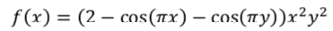

# Nonlinear-Programming
Some basic problems in nonlinear programming using **ipopt** package in Python

Obtain the optimal minimum value of the above function for the pairs (x_init,y_init) in the interval [0,4] and check the effect of choosing the initial points in the answer.

