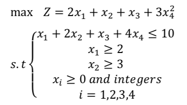

# Nonlinear-Programming
Some basic problems in nonlinear programming using **ipopt** package in Python

<h3>Problem 1</h3>

Obtain the optimal minimum value of the above function for the pairs (x_init,y_init) in the interval [0,4] and check the effect of choosing the initial points in the answer.

<h3>Problem 2</h3>

Obtain the optimal solution of the following problem using the Pyomo library.

<h3>Problem 3</h3>

Solve the following equation:

